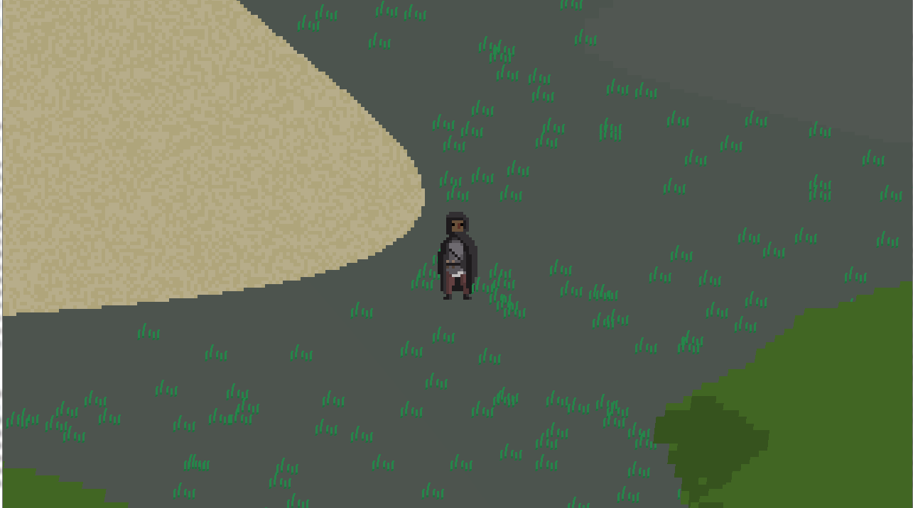
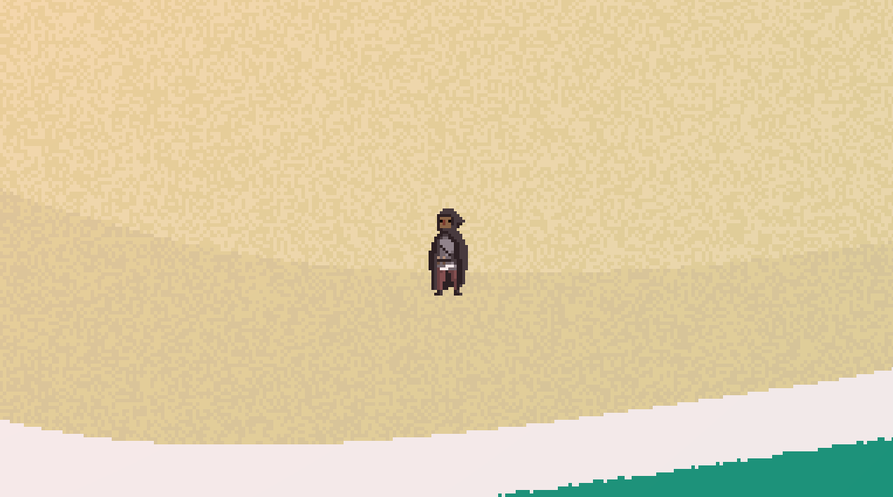
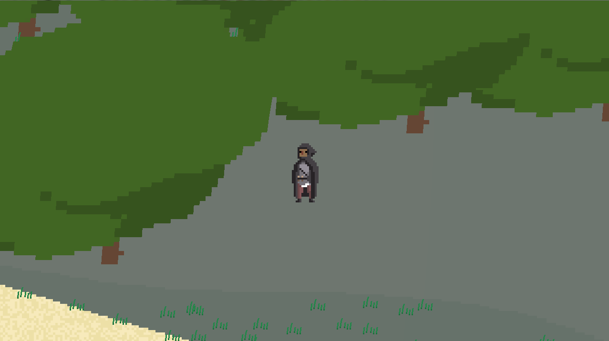

<h1>Desenvolvimento da game engine 2D Narval utilizando Java e OpenGL</h1>

Este trabalho propõe a criação de uma Game Engine 2D para desktop intitulada Narval
e a subsequente elaboração de um protótipo de jogo. A implementação de código será
realizada na linguagem Java e através da API gráfica OpenGL usando GLFW (OpenGL
Frame Work). O protótipo de jogo será elaborado utilizando técnicas de algoritmos procedurais
para geração de artes e ambientes, inteligência artificial para o comportamento
de Non Playable Characters (NPC) e padrões de projeto aplicados a jogos.

<h2>Screenshots</h2>

